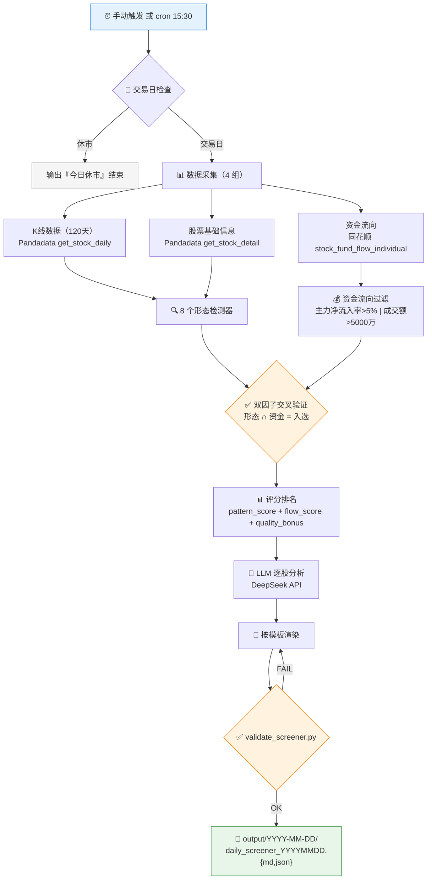

# Post-Market Screener Skill

**简体中文**

> 每日收盘后自动扫描全市场，用 8 个技术形态检测器 + 主力资金流入做双因子交叉验证，Top N 个股 LLM 分析，输出 Markdown 日报 + JSON 结构化数据。

<p align="center">
  
  
  
  
  
  
  
  
</p>

---

## 这是什么

`post-market-screener` 是一个 **Agent Skill**：基于 Pandadata + 同花顺数据，在每日收盘后自动扫描 A 股全市场，通过"技术形态 + 资金流向"双因子交叉验证找到真正有主力资金参与的形态突破个股。

与市场上其他技能的差异化：

| 现有技能 | 为什么不同 |
|---|---|
| 市场每日复盘 | 它是大盘综述，本 Skill 做的是**个股级别的形态+资金双重筛选** |
| A 股选股器 | 它是自然语言交互查询，本 Skill 是**每日定时自动扫描 + 排名输出** |
| Skill Xingtai Catcher | 它是基于 K 线截图/手绘图做形态匹配，本 Skill 是**基于量化指标的规则检测** |
| 龙虎榜数据席位追踪 | 它只追踪龙虎榜席位，本 Skill 是**全市场主力资金净流入过滤** |

核心差异化：**技术形态 ∩ 资金流向 = 双因子交叉验证**。

---

## 扫描流水线



---

## 技术形态 × 检测器

| # | 检测器 | 检测逻辑 | 权重 |
|---|---|---|---|
| 1 | 均线金叉 | MA5 ↑ MA20 | 2 |
| 2 | MACD 金叉 | DIF ↑ DEA | 1 |
| 3 | 多头排列 | MA5 > MA10 > MA20 > MA60 | 1 |
| 4 | 放量突破 | 收盘价创20日新高 + 量 > 1.5×5日均量 | 4 |
| 5 | 布林带突破 | 带宽扩张 + 价格突破上轨 | 3 |
| 6 | 锤子线 | 下影线 ≥ 2倍实体 + 处于下跌趋势 | 1 |
| 7 | 启明星 | 阴线→小实体→阳线（三日反转） | 3 |
| 8 | RSI 超卖反弹 | RSI(14) < 30 + 当日收阳 | 2 |

> 详细公式和计算逻辑见 `references/pattern-formulas.md`

---

## 资金过滤条件

| 条件 | 阈值 | 说明 |
|---|---|---|
| 主力净流入率 | > 5% | 主力净流入 / 成交额 |
| 成交额 | > 5000万 | 排除流动性枯竭个股 |
| 超大单净流入 | > 0 | 机构资金方向确认 |

---

## 快速开始

### 环境准备

```bash
git clone <repo-url> skill-post-market-screener
cd skill-post-market-screener
pip install -r requirements.txt
cp .env.example .env   # 编辑填入你的凭证
```

`.env` 中需要填写：

| 变量 | 说明 | 获取方式 |
|---|---|---|
| `DEFAULT_USERNAME` | Pandadata 用户名 | `86` + 手机号，在 pandadata.pandaaiquant.com 注册 |
| `DEFAULT_PASSWORD` | Pandadata 密码 | 同上 |
| `ANTHROPIC_AUTH_TOKEN` | LLM API 密钥 | DeepSeek 或 Claude API |
| `ANTHROPIC_BASE_URL` | LLM API 地址 | DeepSeek: `https://api.deepseek.com/anthropic` |
| `ANTHROPIC_MODEL` | 模型名称 | `deepseek-v4-pro` 或 `claude-sonnet-4-6` |

> 资金流向数据通过同花顺 AKShare 接口免费获取，无需额外凭证。

### 方式 A：CLI 直接运行

```bash
python run.py                  # 扫描最新交易日
python run.py --date 20260629  # 扫描指定日期
python run.py --no-flow        # 纯形态扫描（跳过资金过滤）
python run.py --top-n 10       # 报告只显示 Top 10
```

也可以 pip 安装后使用命令行入口：

```bash
pip install .
screener                       # 等同于 python run.py
screener --date 20260629 --top-n 10
```

### 方式 B：MCP Server（AI Agent 调用）

启动 MCP Server，让 Claude Code / Cursor / Codex 等 AI Agent 直接调用：

```bash
python mcp_server.py
# 或 pip install . 后：
screener-mcp
```

在 Agent 的 MCP 配置中添加（以 Claude Code 为例，编辑 `~/.claude/mcp.json`）：

```json
{
  "mcpServers": {
    "post-market-screener": {
      "command": "python",
      "args": ["mcp_server.py"],
      "cwd": "/path/to/skill-post-market-screener",
      "env": {
        "ANTHROPIC_AUTH_TOKEN": "sk-xxx",
        "ANTHROPIC_BASE_URL": "https://api.deepseek.com/anthropic",
        "ANTHROPIC_MODEL": "deepseek-v4-pro",
        "DEFAULT_USERNAME": "86xxxxxxxxxxx",
        "DEFAULT_PASSWORD": "xxx"
      }
    }
  }
}
```

项目已自带 `.claude/mcp.json` 模板，可直接复制修改。

Agent 重启后即可用自然语言驱动：*"跑一下今天的收盘扫描"*、*"检查明天是不是交易日"*。

MCP Server 暴露的 3 个 Tool：

| Tool | 功能 |
|---|---|
| `run_screener` | 运行全市场双因子扫描（参数：`date`, `no_flow`, `top_n`） |
| `get_latest_report` | 读取最新一期 Markdown 报告 |
| `check_trading_day` | 检查指定日期是否为 A 股交易日 |

### 定时自动扫描

Windows Task Scheduler（交易日 15:37 自动运行）：

```cmd
schtasks /create /tn "PostMarketScreener" /tr "path\to\scripts\daily_screener.bat"
    /sc weekly /d MON,TUE,WED,THU,FRI /st 15:37 /f
```

### 校验输出

```bash
python scripts/validate_screener.py output/2026-06-29/daily_screener_20260629.md output/2026-06-29/daily_screener_20260629.json --strict
```

---

## 数据来源

| 数据类别 | 来源 | 说明 |
|---|---|---|
| K线数据 | Pandadata `get_stock_daily` | 全市场 ~5186 只，120 天历史 |
| 资金流向 | **同花顺** `stock_fund_flow_individual` (10jqka) | 主力净流入/净额/成交额，独立于东方财富 |
| 股票信息 | Pandadata `get_stock_detail` / `get_trade_list` | 行业分类、市值、上市状态 |
| LLM分析 | DeepSeek API (Anthropic 兼容) | 逐只个股技术+资金综合分析 |

资金流向采用 **3 路径容灾架构**：同花顺（主）→ AKShare/东方财富 → 东方财富直连 API。同花顺作为独立数据源，不受东方财富限流影响。

---

## 在其他 AI Agent 中使用

Skill 通过 **MCP 协议** 与 AI Agent 通信，支持任何兼容 MCP 的 Agent。

| Agent | 集成方式 | 配置文件 |
|---|---|---|
| **Claude Code** | 添加 MCP 配置 或 放到 `.claude/skills/` | `.claude/mcp.json`（项目自带模板） |
| **Cursor** | MCP 配置 或 `.cursor/skills/` | `agents/cursor-rule.mdc` |
| **Codex / OpenAI** | MCP 配置 | `agents/openai.yaml` |
| **其他 MCP Agent** | MCP 标准协议，直接配置 `mcp_server.py` | — |
| **不支持 MCP 的 LLM** | 注入 Portable Loader Prompt | `agents/portable-loader.md` |

所有路径均使用真实数据（Pandadata + 同花顺 + LLM API），无 mock 模式。

---

## 分发给其他人

**方式 1 — GitHub（推荐）：**

```bash
# 你（作者）推送：
git remote add origin git@github.com:<你的账号>/skill-post-market-screener.git
git push -u origin master

# 对方接收：
git clone https://github.com/<你的账号>/skill-post-market-screener.git
cd skill-post-market-screener
pip install -r requirements.txt
cp .env.example .env  # 填自己的凭证
python run.py
```

**方式 2 — pip 一行安装：**

```bash
pip install git+https://github.com/<你的账号>/skill-post-market-screener.git
# 配置 .env 后：
screener
```

**方式 3 — Zip 打包：**

```bash
git archive -o post-market-screener.zip HEAD
# 发给对方解压即可
```

对方只需要：
- Python 3.10+
- Pandadata 凭证（用自己手机号免费注册）
- LLM API Key（DeepSeek 或 Claude）

---

## 目录结构

```
skill-post-market-screener/
├── SKILL.md                         # 技能入口：工作流、评分公式、约束规则
├── README.md                        # 项目介绍（本文件）
├── OPERATION_MANUAL.md              # 详细操作手册
├── LICENSE                          # GPLv3
├── config.json                      # 运行配置
├── pyproject.toml                   # Python 项目元数据 + pip 安装入口
├── requirements.txt                 # Python 依赖
├── .env.example                     # 环境变量模板
├── .gitignore                       # Git 忽略规则
├── run.py                           # CLI 主入口
├── mcp_server.py                    # MCP Server（3 个 Tool）
├── .claude/
│   └── mcp.json                     # Claude Code MCP 配置模板
├── core/
│   ├── data_fetcher.py              # 数据获取（Pandadata K线+股票信息）
│   ├── flow_fetcher.py              # 资金流向获取（同花顺→AKShare→东方财富直连 3路径）
│   ├── pattern_detector.py          # 8 个技术形态检测器（连续强度信号）
│   ├── flow_filter.py               # 资金流向过滤器
│   ├── scorer.py                    # 评分与排名（含 Z-score 行业中性化）
│   ├── reporter.py                  # Markdown + JSON 报告生成（含数据溯源）
│   ├── pipeline.py                  # 端到端流水线编排器
│   ├── cache.py                     # 日期分组的 Parquet 缓存（含 meta.json）
│   └── mock_data.py                 # Mock 数据生成器（内部测试用）
├── llm/
│   └── analyst.py                   # LLM 逐股分析（DeepSeek/Claude，并发调用）
├── tests/
│   ├── test_pattern_detector.py     # 45 个形态检测器测试
│   ├── test_integration.py          # 32 个流水线/集成测试
│   ├── test_analyst.py              # 24 个 LLM 分析师测试
│   ├── test_api_integration.py      # 25 个 API 集成测试（含 3 路径容灾）
│   └── test_reporter.py             # 28 个报告生成测试
├── references/
│   ├── pandadata-map.md             # 数据需求到 Pandadata 接口的路由表
│   ├── pattern-formulas.md          # 8 个形态检测器的公式、参数、权重
│   └── report-template.md           # 日报模板 + LLM 逐股分析 Prompt
├── scripts/
│   ├── validate_screener.py         # 输出完整性校验器
│   ├── daily_screener.bat           # Windows Task Scheduler 入口
│   ├── benchmark.py                 # 性能基准测试
│   └── analyze_weights.py           # IC 分析与权重优化
├── agents/
│   ├── openai.yaml                  # OpenAI/Codex 适配
│   ├── cursor-rule.mdc              # Cursor IDE 适配
│   └── portable-loader.md           # 通用加载器
└── output/                          # 按日期分文件夹
    └── YYYY-MM-DD/
        ├── daily_screener_YYYYMMDD.md
        └── daily_screener_YYYYMMDD.json
```

---

## 核心约束

| 约束 | 说明 |
|---|---|
| 双因子必须同时成立 | 形态或资金任一不达标即淘汰 |
| 流动性门槛 | 成交额 < 5000万自动排除 |
| 不荐股 | 措辞为「值得关注」「可跟踪」，禁止说「买入」「目标价」 |
| 交易日智能跳过 | 节假日不跑空 |
| 数据容错 | 单只股票数据缺失跳过，不阻塞全流程 |
| 评分可审计 | JSON 输出必须包含每只股票的评分子项（含行业中性化调整） |
| 数据溯源 | 报告明确标注每类数据的真实来源和获取状态 |

---

## 免责声明

本 Skill 输出仅供研究参考，不构成任何投资建议。投资者应独立判断并承担交易风险。

## License

This project is licensed under the GNU General Public License v3.0. See [LICENSE](LICENSE).

## PandaAI / QUANTSKILLS 社群

<div align="center">
  <sub>扫码加入 PandaAI 社群，交流 QUANTSKILLS 技能、Agent 工作流与量化研究实践。</sub>
</div>
